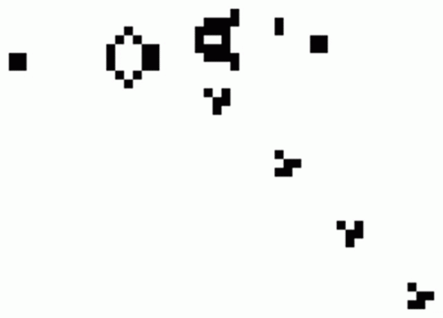

# Game-Of-Life

## Введение

Игра «Жизнь», придуманная английским математиком Джоном Конвеем
в 1970 г., – это клеточный автомат, представляющий собой дискретную
динамическую систему [1]. Его используют для моделирования процессов,
происходящих при зарождении, развитии и гибели колонии живых организмов.
Действие игры происходит на бесконечной плоскости, разделенной на
клетки. Каждая клетка имеет восемь соседей и может находиться в одном из
двух состояний – живом или мертвом. Основная идея игры состоит в том,
чтобы, начав с некоторой конфигурации живых клеток, проследить за ее
эволюцией.
Начальная конфигурация живых клеток определяется игроком. Каждое
следующее поколение колонии рассчитывается на основе предыдущего по
следующим правилам («генетическим законам»):
1. В пустой (мертвой) клетке зарождается жизнь, если с ней соседствуют три
живые клетки;
2. Живая клетка продолжает жить, если с ней соседствуют две или три
живые клетки;
3. Живая клетка умирает от одиночества, если у нее меньше двух живых
соседей;
4. Живая клетка умирает от перенаселенности, если у нее больше трех.

Игра прекращается, если:
1. На поле не останется ни одной живой клетки;
2. Конфигурация на очередном шаге в точности (без сдвигов и поворотов)
повторит себя же на одном из более ранних шагов;
3. При очередном шаге ни одна из клеток не меняет своего состояния.

Часто исходные конфигурации клеток переходят в колебательный режим
или обретают устойчивые состояния. Примером периодически повторяющейся
фигуры со смещением может служить «планер» (glider), его особенностью
является способность спонтанно возникать и перемещаться за пределы
видимого пространства.

## Постановка задачи

Целью настоящей работы является изучение основных свойств и
преимуществ объектно-ориентированного программирования посредством
реализации симулятора игры «Жизнь» на языке программирования Java [2].
Требования к программному решению:
1. Управление приложением должно осуществляться вводом команд из
консоли.
2. Состояние игрового поля должно демонстрироваться в окне, созданном с
помощью графической библиотеки Swing.
3. Размерность поля (число строк, число столбцов) должна задаваться
пользователем.
4. Верхнюю границу поля следует считать продолжением нижней, а левую
границу – продолжением правой.
5. Исходные колонии клеток должны задаваться текстовыми
файлами-(пример представлен на рисунке 2).
6. Пользователю должна быть предоставлена возможность указать путь к
файлу с описанием фигуры (или колонии) и ее местоположение на поле в
виде координат левого верхнего угла минимального прямоугольника,
ограничивающего фигуру.
7. Структура кода должна отвечать парадигме объектно-ориентированного
программирования.
8. Программа не должна содержать графические элементы управления и
обрабатывать события.
